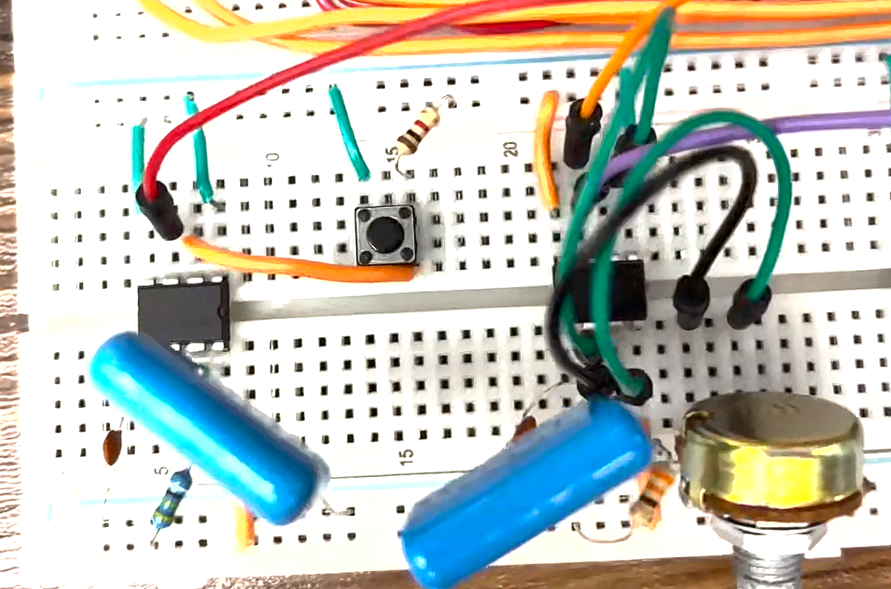
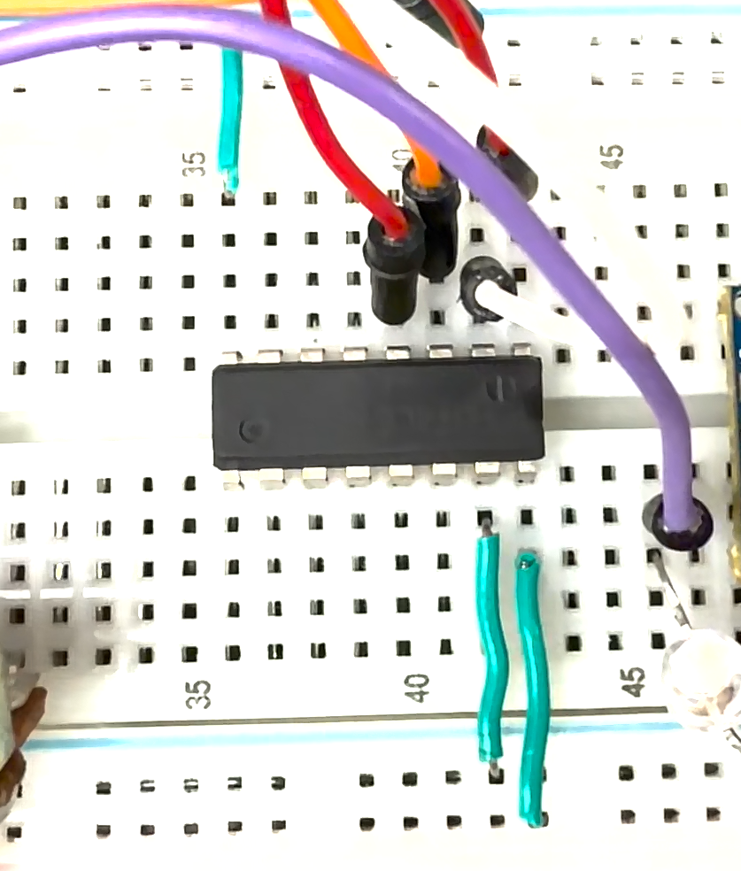
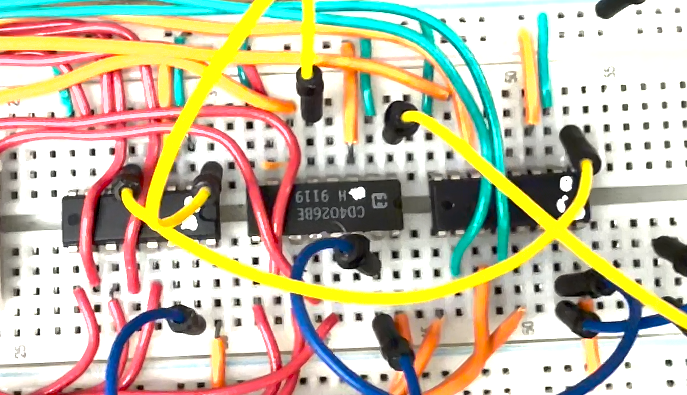
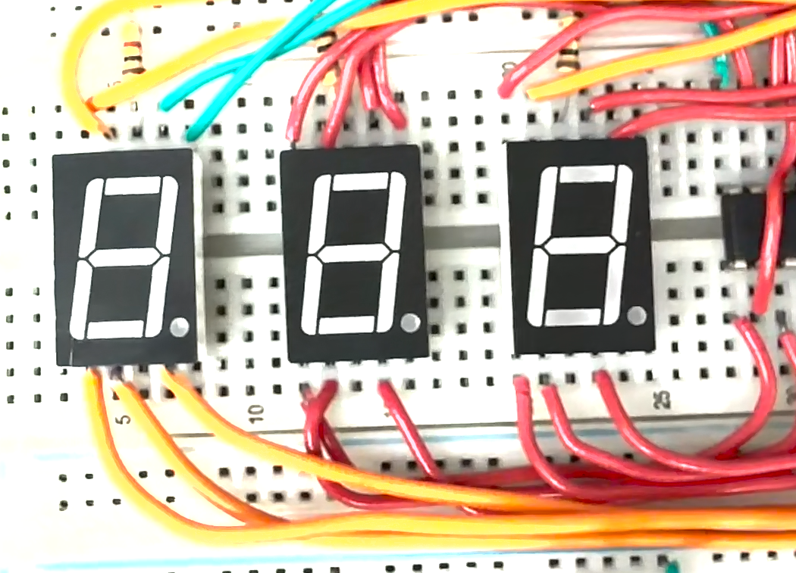
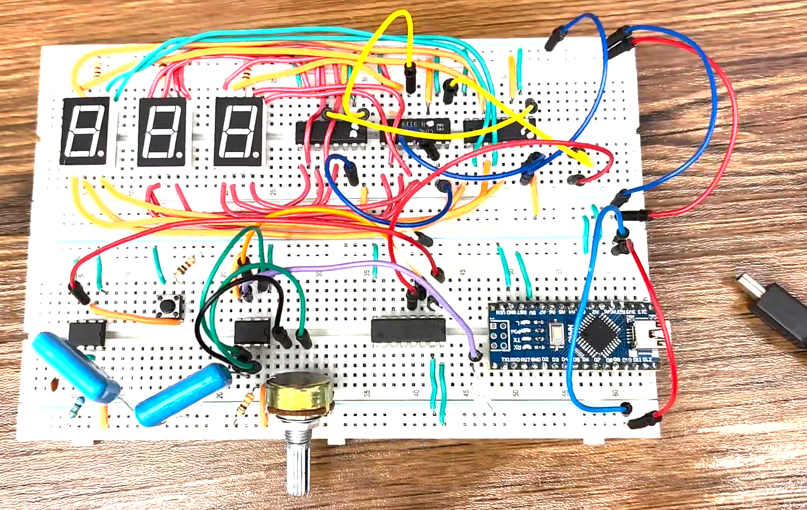
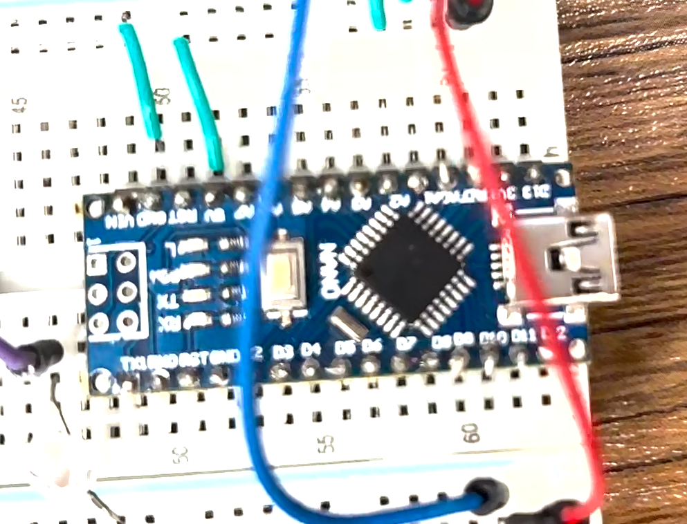

# NE555 Digital Pulse Counter

A digital pulse counter circuit designed and simulated using NE555 timer ICs and CD4026 decade counters.

## Overview

This project measures the number of generated pulses within a one-second time interval.

The circuit consists of:
- NE555 timer based pulse generator
- NE555 timing circuit
- AND gate control section
- CD4026 decade counter stages
- Seven segment display modules

The circuit was first simulated in Proteus and then implemented on a breadboard.

---

# Circuit Sections

## 1. NE555 Pulse Generator

The first NE555 timer is configured as an astable oscillator.

It generates clock pulses that are applied to the counter section.

---

## 2. AND Gate Control

The AND gate controls the counting process by allowing pulses to pass only during the defined measurement interval.

---

## 3. CD4026 Counter Section

Four CD4026 decade counter ICs are used to count the input pulses.

Each CD4026 drives a seven segment display.

---

## 4. Seven Segment Display

The measured pulse count is displayed using four seven segment displays.

---

## Hardware Implementation

Complete hardware implementation of the circuit on a breadboard.

---

## Power Supply

An Arduino board is used only as a 5V power supply source.

It does not perform any control, processing, or counting operation.

---

# Simulation

The Proteus simulation file and demonstration video are available in this repository.

## Files

- Proteus simulation project
- Hardware implementation images
- Simulation demonstration video

---

# Components

- NE555 Timer IC
- CD4026 Decade Counter IC
- Seven Segment Displays
- AND Gate IC
- Resistors
- Capacitors
- Arduino board (power supply only)

---

# Author

Arghavan Memari
